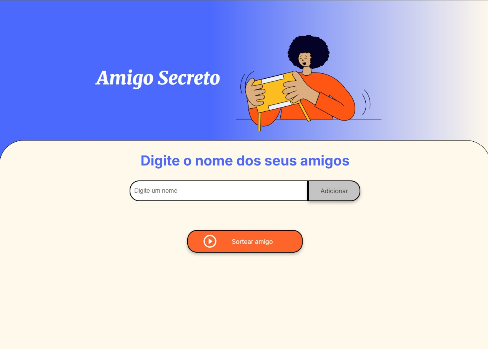

# 🎁 Amigo Secreto - Lista e Sorteio

Projeto simples para gerenciar uma lista de amigos e sortear aleatoriamente um "amigo secreto". Ideal para festas, confraternizações e encontros de fim de ano.

---

## 🚀 Funcionalidades

- ✅ Adicionar nomes à lista
- ✅ Impedir duplicidade de nomes
- ✅ Remover amigos da lista
- ✅ Exibir lista atualizada na tela
- ✅ Sortear aleatoriamente um amigo da lista
- ✅ Exibir resultado do sorteio

---

## 🛠 Tecnologias utilizadas

- HTML5
- CSS3
- JavaScript (ES6+)
- [Font Awesome](https://fontawesome.com/) para ícones

---

## 💡 Como usar

1. Digite o nome de um amigo no campo de entrada.
2. Clique em **Adicionar** para incluí-lo na lista.
3. Veja os nomes listados com opção de remover.
4. Clique em **Sortear** para descobrir quem foi o sorteado.
5. O nome sorteado será exibido em verde.

---

## 📷 Preview

Você pode acessar uma versão online do projeto [clicando aqui](https://laercioaraujo25.github.io/challenge-amigo-secreto/)  

---

## 🙏 Agradecimentos

Agradeço à **Alura Latam** e à **Oracle** pela oportunidade de aprendizado e desenvolvimento através do programa de formação.

---

💙 Feito com dedicação para tornar o sorteio de amigo secreto mais divertido e prático!
